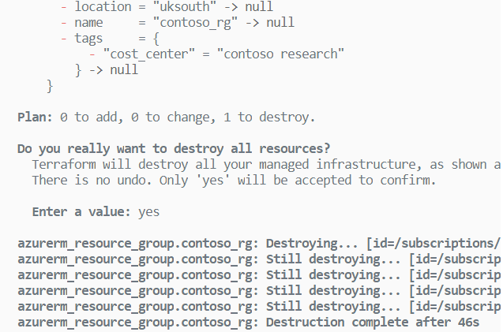
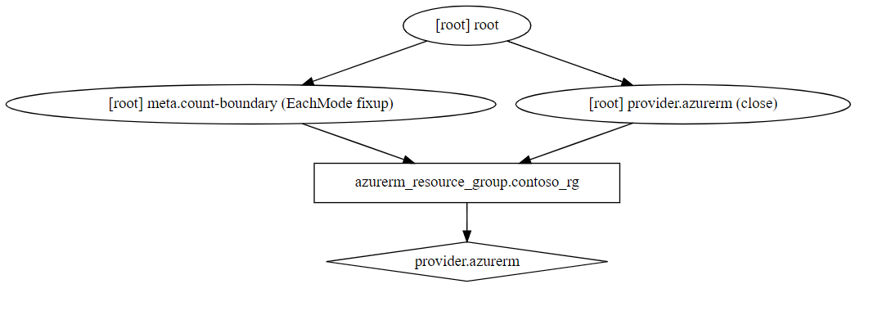

#### Understand the terraform core workflow. (write, plan, apply)

## Day n operation (destroy)

**destroy**

Here we remove the resource group that we created using `destroy` operation.

`Destroy` depends on your state file to decide what needs to be removed.

```bash
# make sure you are running this from the contoso folder
terraform destroy
```

You should see a terminal output stating what will be destroyed.

When prompted, type `yes` to approve. This operation may take some time, and terraform will provide status updates every 10 seconds or so.

_Example Screenshot_:




**Verify**

Verify that the `contoso_rg` resource group has been deleted from your azure subscription.

```bash
# You can use the portal or run the below azure cli command
az group show --name "contoso_rg"
```

---

## Recap

#### List of commands covered so far

* init
* plan
    * plan -out "planfile"
* apply
    * apply -auto-approve "planfile"
* show
* destroy 

If you have managed to finish this lab ahead of time, feel free to spend some time around the docs and try out above commands with other options. 

Just make sure to clean up the infrastructure prior to next lab.

* https://www.terraform.io/docs/commands/init.html
* https://www.terraform.io/docs/commands/plan.html
* https://www.terraform.io/docs/commands/apply.html
* https://www.terraform.io/docs/commands/show.html
* https://www.terraform.io/docs/commands/destroy.html

---

[**Optional / Bonus task**]

Take a look at **`graph`** command. Terraform builds a dependency graph from the Terraform configurations, and walks this graph to generate plans, refresh state, and more

See: 
* https://www.terraform.io/docs/commands/graph.html
* https://www.terraform.io/docs/internals/graph.html

> Note: To see the graph in svg format, `graphviz` needs to be installed. This will not work in cloud shell as there isn't sudo access, but should work on vs code online. (or local environments)

> http://www.graphviz.org/download/

For this lab, the resource graph would look something like below.



----